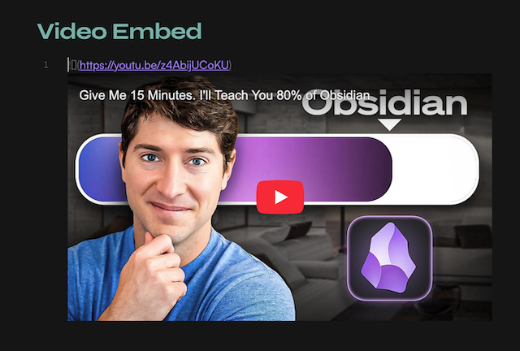
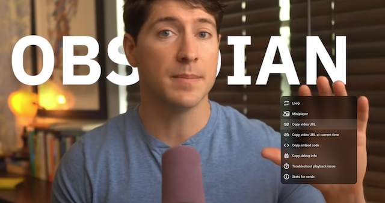

> Simply paste a YouTube URL on an **empty line** in an Obsidian note and it's instantly converted into your preferred embed format (markdown, iframe or div).

### ⭐️ **Roadmap** unlocks with GitHub stars:

- _100 GitHub ⭐_ : more video providers (Vimeo, Dailymotion, local files…)
- _1 000 GitHub ⭐_ : auto-import video metadata (title, thumbnail) from URL

### **Features**

- intercepts YouTube URLs pasted on empty lines
  - youtu.be
  - shorts
  - embed URLs
- three preview options to choose from
    - simple markdown
    - responsive in iframe and div modes
- works on desktop and mobile

### **Embed styles**

Choose your preferred embed mode in Obsidian **Settings... → Media Embed**.

| Style | Output | Responsive |
|---|---|---|
| markdown | `` | no — fixed size |
| iframe | `<iframe ...>` | yes — fills pane width |
| div | `
<iframe ...>` | yes, in a frame — bulletproof |

> Not sure which to pick? See [pros & cons and edge-case guide](https://github.com/punkyard/obsidian-media-embed/blob/main/docs/modes-pros-and-cons.md).

###### Results in source mode:

---

### **Usage**

1. copy YouTube video URL (right-click on it: Copy video URL)
2. open any note
3. place your cursor on a blank line
4. paste the YouTube URL (`Cmd+V` / `Ctrl+V`)
5. the URL is automatically replaced with the embed

###### Supported URL formats:
- `https://www.youtube.com/watch?v=...`
- `https://youtu.be/...`
- `https://www.youtube.com/shorts/...`
- `https://www.youtube.com/embed/...`

 

  

 

---

### **Installation**

#### From Obsidian Community Plugins

1. open Obsidian **Settings... → Community plugins**
2. disable `Safe mode` if prompted
3. click `Browse` and search for `Media Embed`
4. install and enable the plugin
5. open `Options` and choose your preferred style (markdown, iframe, div)

#### Manual

1. go to the [latest release](../../releases/latest) and download `main.js` and `manifest.json`
2. create a folder `<your vault>/.obsidian/plugins/media-embed/`
3. place both files in that folder
4. reload Obsidian and enable the plugin in **Settings → Community plugins**

---

### **Contributing**

Found a bug or have a suggestion? You're welcome to [open an issue](../../issues). See [CONTRIBUTING](docs/CONTRIBUTING.md) for development setup and pull request guidelines.

---

### **License**

This project is licensed under **[MIT](LICENSE)**.

---

made with ⏳ by <a href="https://github.com/punkyard">punkyard</a>

